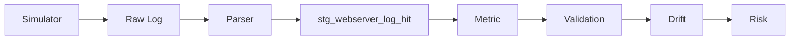

# Synthetic Web Log Simulator Architecture

## Source Data Generation Strategy for Data Reliability Platforms

---

## 1. Overview

In data reliability systems, the first fundamental challenge is:

> “How can we obtain anomalous data?”

Production data has inherent limitations:

* Anomalies rarely occur
* There are no labels for abnormal cases
* Reproducing the same scenario is difficult

In other words, before applying ML,
there is already a lack of **trainable and testable data**.

To address this, the system was designed with the following principle:

Generate realistic logs,
and inject anomalies intentionally on top of them.

---

## 2. Characteristics of Web Log Data

The simulator design starts from understanding the nature of web logs.

---

### 2.1 Flow-based Data

Web logs are not isolated events but sequences of user behavior.

```
home → login → dashboard → transfer → success
```

A single page view has little meaning.
Analysis must be done at the **session and funnel level**.

---

### 2.2 Identity Structure

Web logs are built around multiple identity layers:

* pcid (device / cookie)
* sid (session)
* uid (logged-in user)

Relationship:

```
pcid → multiple sessions (sid)
pcid → uid (acquired after login)
```

This structure is the foundation for user behavior analysis.

---

### 2.3 Time-dependent Patterns

Web logs are strongly time-dependent:

* Hourly patterns
* Weekday vs weekend differences
* External factors (campaigns, weather, etc.)

```
traffic = f(hour, day_of_week, external factors)
```

---

### 2.4 Probabilistic Distribution

Web logs are not deterministic but probabilistic:

* Page distribution
* Event mix
* Latency / status distribution
* User behavior patterns

Therefore, the simulator must be **probability-driven**.

---

## 3. Simulator Architecture

### Overall Structure

```mermaid
flowchart LR

A[Config (YAML)] --> B[Simulator Core]

subgraph Simulator
B --> C[Traffic Model]
B --> D[Identity Model]
B --> E[Session Generator]
B --> F[Event Generator]
B --> G[Exogenous Layer]
end

G --> B

C --> H[Session]
D --> H
E --> I[Event Stream]
F --> I

I --> J[Apache Log + KV]

J --> K[Parser / Loader]
K --> L[stg_webserver_log_hit]
```

---

### Description

The simulator is not a simple log generator.

It combines:

* Traffic modeling
* Identity modeling
* Session generation
* Event generation
* Exogenous factors

to produce **behavior-driven, realistic data**.

---

## 4. Core Design Principles

---

### 4.1 Config-driven Architecture

Industry and service characteristics are defined in configuration, not code.

```yaml
finance_bank.yaml
- page pool
- event mix
- traffic pattern
- user behavior
```

Advantages:

* Extensible across domains
* Supports drift scenario experiments
* Flexible ML dataset generation

---

### 4.2 Generator-centric Design

The core component is `generator.py`.

Input:

* profile (YAML)
* exogenous variables

Output:

* session
* event
* log

Flow:

```
exogenous → traffic
          → session generation
          → event generation
          → log output
```

---

### 4.3 Exogenous Layer

External factors drive changes in logs:

* Weather
* Campaigns
* Weekday / weekend
* System conditions

Design principle:

> Logs should change based on external conditions, not internal logic

---

### 4.4 Identity & Session Model

Structure:

```
pcid (device)
  └── sid (session)
        └── uid (optional)
```

Characteristics:

* uid is not initially available
* acquired during session (login)
* persists across returning visits

This models **real user lifecycle behavior**.

---

### 4.5 Traffic Model

```
traffic = base × hourly × weekday × exogenous
```

Key aspects:

* Hourly traffic patterns
* Day-of-week variations
* External event influence

---

### 4.6 Event Generation

Event generation flow:

```
session creation
 → page sequence generation
 → event mix application
 → latency / status assignment
 → log generation
```

---

### 4.7 KV-based Log Design

Log format:

```
IP [timestamp] "GET /path HTTP/1.1" status ... "KV"
```

KV fields:

```
pcid=
sid=
uid=
evt=
page_type=
latency_ms=
weather=
drift=
```

Purpose:

* Easier ETL processing
* Feature engineering readiness
* Drift analysis support

---

## 5. Drift Scenario Design

Drift is defined as **distribution shift**, not simple value change.

Example:

| Element   | Change   |
| --------- | -------- |
| traffic   | increase |
| page mix  | shift    |
| event mix | shift    |
| latency   | increase |
| error     | increase |

```
Drift = Distribution Shift
```

---

## 6. Financial Web Log Modeling

Characteristics of financial services:

* Login-centric flow
* Short sessions
* High return rate
* Activity concentrated in business hours

Example funnel:

```
login → dashboard → account → transfer → success
```

---

## 7. Testable Data Generation

The simulator is not purely random.

It enforces:

* Time consistency
* Field completeness
* Identity growth

This makes it a **verifiable data generator**.

---

## 8. Data Generation Strategy

Problems:

* Limited access to real data
* Lack of anomalous data
* No labels

Solution:

```
generate realistic data
 → inject anomalies
 → create labels
 → enable ML training
```

---

## 9. Position in Data Architecture



---

### Meaning

The simulator is the **starting point of the entire data pipeline**,
providing input data for all downstream layers.

---

## 10. Design Value

### 1. Realism

* Reflects real traffic patterns
* Includes user behavior modeling

---

### 2. Extensibility

* Configuration-driven design
* Applicable across industries

---

### 3. Experimentability

* Drift scenario injection
* Adjustable intensity

---

### 4. ML Readiness

* Enables label generation
* Naturally supports feature engineering

---

## Conclusion

This simulator is not just a log generator.

It is an architecture for building
a **controlled, experimentable data environment for data reliability systems**.

