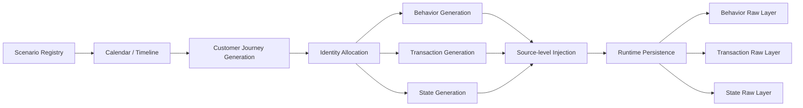

# Data Generation Architecture

## Overview

In v0.5, Data Generation is not simply synthetic log generation.

More precisely, it is designed as:

```text
Reality-Compatible
Operational Reliability Source Generation
```

The objective is not merely:

```text
generating logs
```

but rather:

```text
reproducibly generating
realistic operational distortion
and cross-domain inconsistency
```

across:

```text
Behavior
↔ Transaction
↔ State
```

layers.

The current structure evolves beyond the earlier v0.1–v0.3 web log simulator architecture into a broader:

```text
Operational Reliability Source Architecture
```

for measuring operational inconsistency across multiple domains.

---

# Overall Structure



---

# Evolution from Web Log Simulator

The earlier architecture (v0.1–v0.3) was centered around:

```text
Synthetic Web Log Simulator
```

The primary objectives at that stage were:

* realistic traffic generation
* session realism
* identity continuity
* drift scenario injection

However, v0.5 expands the architecture into:

```text
Web Log
→ Behavior Layer

Business Event
→ Transaction Layer

Workflow Transition
→ State Layer
```

The current architecture is therefore no longer a simple weblog simulator.

Instead, it becomes a:

```text
Behavior + Transaction + State
Cross-domain Source Generator
```

---

# Core Design Philosophy

The most important design principle of v0.5 is:

```text
The goal is not synthetic data generation itself.
The goal is realistic operational distortion generation.
```

The architecture focuses on reproducing:

```text
source anomaly
→ downstream distortion
→ operational risk
```

across the entire pipeline.

This extends the original simulator philosophy:

```text
generate realistic logs
→ inject anomalies intentionally
→ reproduce operational distortion
```

---

# Scenario Registry

Scenario Registry defines:

```text
what kind of anomaly
should be injected
and how it should behave
```

Representative scenarios include:

```text
baseline
source_partial_missing
transaction_missing_anomaly
state_missing_anomaly
source_identity_drift
source_schema_drift
```

An important principle is:

```text
Scenario
≠
Risk Label
```

In v0.5, scenarios are treated as:

```text
source mutation policies
```

rather than predefined risk outputs.

---

# Calendar / Timeline Layer

One of the important concepts inherited from the earlier simulator is:

```text
time-dependent operational patterns
```

v0.5 extends this into:

```text
calendar-driven replay orchestration
```

The timeline layer incorporates:

* weekday / weekend patterns
* campaigns
* holidays
* weather conditions
* traffic spikes
* system degradation

The objective is:

```text
realistic operational flow generation
```

rather than isolated random data generation.

---

# Customer Journey Generation

The earlier simulator architecture focused on:

```text
session-based weblog generation
```

v0.5 evolves this into:

```text
Customer Journey lifecycle generation
```

Example:

```text
anonymous browse
→ search
→ product_view
→ cart
→ login
→ checkout
→ payment
→ delivery
```

Current realism factors include:

* repeat visitors
* session continuity
* abandoned carts
* async retries
* duplicate clicks
* non-linear navigation
* partial authentication

The goal is:

```text
reality-compatible behavioral generation
```

rather than idealized flows.

---

# Identity Allocation

The earlier simulator architecture already emphasized:

```text
pcid
sid
uid
```

based identity lifecycle modeling.

v0.5 expands this into:

```text
journey_id
order_id
payment_id
delivery_id
cart_id
coupon_id
transaction_id
```

These identities function as:

```text
cross-domain lineage keys
```

connecting:

```text
Behavior ↔ Transaction ↔ State
```

A key principle of v0.5 is:

```text
Identity realism
```

Example:

```text
browse stage:
anonymous possible

checkout/payment stage:
authenticated possible
```

This reflects realistic:

```text
partial identity consistency
```

observed in operational systems.

---

# Behavior Generation

The Behavior Layer preserves the earlier:

```text
W3C-compatible weblog structure
```

Representative events:

```text
page_view
search
product_view
cart_view
checkout_click
payment_click
```

Additional metadata includes:

```text
journey_id
journey_stage
product_id
cart_id
coupon_id
order_id
payment_id
scenario_id
source_anomaly
```

The primary role of this layer is:

```text
behavioral observation generation
```

---

# Transaction Generation

This is one of the newly expanded layers in v0.5.

Representative transaction events:

```text
cart_created
payment_requested
payment_approved
order_created
refund_requested
```

The structure is closer to:

```text
JSONL-based business event architecture
```

The primary role is:

```text
Business Event Truth generation
```

---

# State Generation

Another major addition in v0.5 is the State Layer.

Representative state transitions:

```text
order_state:
created → delivered

payment_state:
requested → approved

delivery_state:
assigned → delivered
```

The primary role is:

```text
Workflow / Operational State Truth generation
```

This allows the system to measure not only whether transactions exist, but also:

```text
whether operational states actually continued correctly
```

---

# Source-level Anomaly Injection

One of the important principles inherited from the earlier simulator is:

```text
Drift = Distribution Shift
```

In v0.5, this evolves into:

```text
source-level injection only
```

Meaning:

```text
no canonical mutation
no measurement mutation
no semantic mutation
```

This principle exists because the architecture must preserve:

```text
Propagation Provenance
```

The core objective is to measure:

```text
source anomaly
→ downstream distortion
```

itself.

---

# Runtime Persistence

Generated sources are stored through runtime persistence layers.

Examples:

```text
raw_snapshot_manifest
stg_webserver_log_hit
v05_transaction_log_raw
v05_state_log_raw
```

An important principle is:

```text
Storage itself is not the objective
```

Persistence exists for:

```text
replay reproducibility
evidence materialization
lineage preservation
```

Meaning:

```text
Persistence
=
cross-cutting operational infrastructure
```

---

# Final Direction

v0.5 Data Generation is not simply synthetic generation.

More precisely, it is:

```text
Operational Reliability Distortion Generation
```

The objective is not:

```text
log generation itself
```

but rather:

```text
reproducibly generating
realistic operational distortion
and cross-domain inconsistency
```

for operational reliability analysis.

---

# Final Summary

## Customer Journey

```text
Operational Truth Model
that generates
Behavior / Transaction / State
```

---

## Data Generation

```text
Architecture that generates
realistic operational distortion
and cross-domain inconsistency
based on Operational Truth
```
