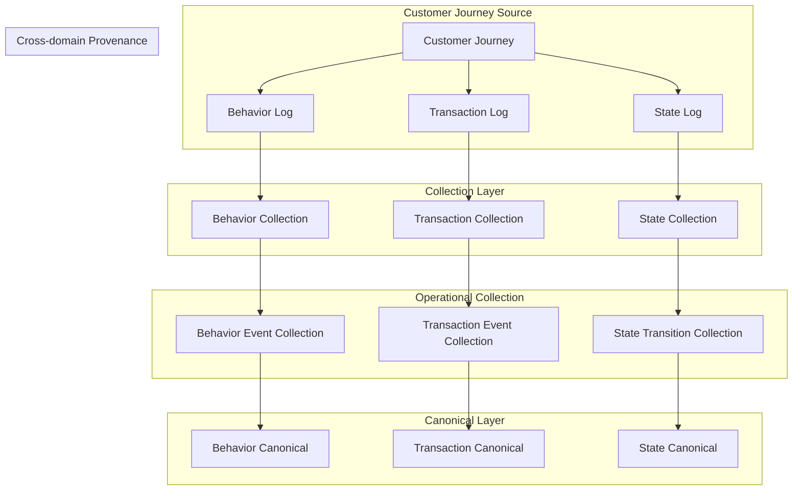

# Data Ingestion Architecture

The current ingestion layer is not designed as a simple behavioral log ingestion pipeline.

Instead, the architecture focuses on collecting:

```text
Behavior Log
↔ Transaction Log
↔ State Log
```

as:

```text
Cross-domain Operational Evidence
derived from a single Customer Journey
```

The ingestion layer is therefore not a conventional ETL ingestion structure.

Instead, it guarantees:

```text
Source Provenance
+
Scenario Identity Propagation
+
Cross-domain Lineage Preservation
+
Replay Reproducibility
```

within an:

```text
Operational Reliability Collection Architecture
```

framework.

---

# Collection Architecture Overview



---

# Overall Architecture

The core structure of the current collection architecture is:

```text
Customer Journey
→ Behavior Collection
→ Transaction Collection
→ State Collection
→ Canonical Operational Evidence
```

The architecture is therefore not limited to:

```text
behavioral log ingestion only
```

Instead, the system jointly collects:

```text
behavioral flow
+
transaction flow
+
state transition flow
```

within a:

```text
Cross-domain Operational Collection Architecture
```

framework.

---

# Customer Journey-driven Collection

The starting point of the collection architecture is:

```text
Customer Journey
```

Meaning:

```text
Behavior Log
→ Transaction Log
→ State Log
```

are not independently generated streams.

Instead, they are:

```text
parallel derivatives
from a single customer journey
```

Example:

```text
restaurant_view
→ menu_click
→ add_cart
→ payment
→ order_created
→ rider_assigned
→ delivered
```

Within this journey:

```text
behavior logs
transaction logs
state logs
```

are generated simultaneously.

The architecture therefore becomes:

```text
Journey-aware Collection
```

---

# Behavior Collection

Behavior Collection handles behavioral log ingestion.

Representative sources:

```text
W3C access log
web event log
behavior event stream
```

Representative events:

```text
page_view
product_view
click
add_cart
checkout
payment_attempt
```

Its primary role is:

```text
preserving behavioral flow provenance
```

Meaning:

```text
Which visitor/session/journey
generated which behavior?
```

Representative identities:

```text
pcid
sid
uid
journey_id
```

---

# Transaction Collection

Transaction Collection ingests business transaction events.

Representative sources:

```text
commerce transaction events
payment events
order events
refund events
coupon events
```

Representative events:

```text
order_created
payment_requested
payment_success
coupon_applied
refund_requested
cancel_requested
```

Its primary role is:

```text
preserving transaction evidence
connected to behavioral flow
```

Meaning:

```text
Which business transaction
was generated after which behavior?
```

Representative identities:

```text
order_id
payment_id
transaction_id
coupon_id
journey_id
```

---

# State Collection

State Collection ingests operational workflow state transitions.

Representative sources:

```text
delivery state
payment state
refund state
order workflow state
```

Representative events:

```text
order_confirmed
delivery_assigned
delivered
refund_completed
payment_confirmed
```

Its primary role is:

```text
preserving operational workflow state
after transactions occur
```

Meaning:

```text
Did transactions correctly propagate
into operational workflow states?
```

Representative identities:

```text
delivery_id
refund_id
payment_id
order_id
journey_id
```

---

# Provenance Preservation

One of the core principles of the current collection architecture is:

```text
all logs are collected
with provenance preservation
```

Meaning the system preserves:

```text
which source/run/scenario
generated which operational evidence
```

Representative lineage identifiers:

```text
source_gen_run_id
scenario_id
scenario_name
source_generation_scenario
journey_id
```

One important architectural principle is:

```text
requested scenario
≠
source generation scenario
```

Example:

```text
scenario_name = source_identity_drift
source_generation_scenario = baseline
```

Meaning:

```text
baseline journey preservation
+
runtime anomaly injection
```

The architecture therefore becomes:

```text
Scenario-aware Collection
```

---

# Cross-domain Lineage

The current collection architecture preserves lineage across:

```text
Behavior
↔ Transaction
↔ State
```

This enables downstream reconciliation analysis of:

```text
behavior without transaction
transaction without behavior
state without transaction
```

Representative linkage identities:

```text
journey_id
order_id
payment_id
delivery_id
coupon_id
refund_id
```

The architecture therefore becomes:

```text
Cross-domain Operational Lineage Collection
```

---

# Replay Reproducibility

Replay and reproducibility are fundamental architectural goals.

Meaning:

```text
same date
same scenario
```

may be executed repeatedly.

Therefore lineage authority cannot rely only on:

```text
scenario_name
```

Instead, the primary lineage authority is:

```text
source_gen_run_id
```

This enables:

```text
Replay-compatible Operational Collection
```

---

# Architecture Principles

The core principles of the current collection architecture are:

---

## Collection ≠ Simple Ingestion

---

## Collection = Operational Provenance Preservation

---

## Behavior ↔ Transaction ↔ State Lineage Preservation

---

## Scenario Identity Propagation Preservation

---

## Replay Reproducibility Preservation

---

# Final Architecture Definition

The current ingestion layer is not a simple ingestion architecture.

More precisely, it is a:

```text
Behavior
↔ Transaction
↔ State
```

based:

```text
Scenario-aware
Cross-domain Operational Collection Architecture
```

And more specifically, it guarantees:

```text
Source Provenance
+
Cross-domain Lineage
+
Scenario Identity Propagation
+
Replay Reproducibility
```

as the:

```text
Operational Reliability Collection Foundation
```
