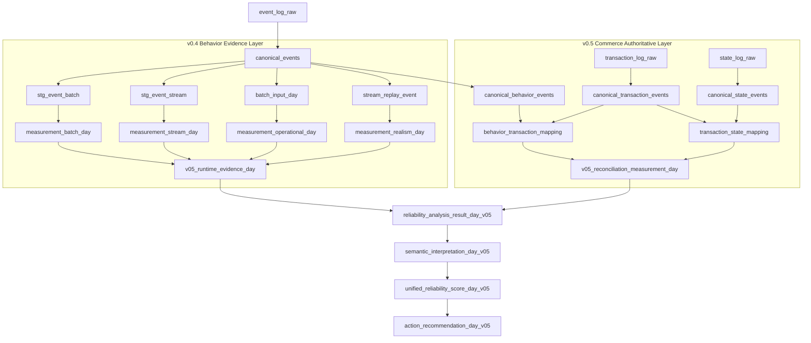

# Data Transformation Architecture

The current transformation layer is not designed as a simple ETL transformation pipeline.

Instead, the architecture focuses on:

```text id="9n9vxl"
Behavior Evidence Transformation
+
Commerce Reconciliation Transformation
+
Operational Runtime Evidence Integration
```

The purpose of transformation is not merely reshaping data.

Its purpose is to:

```text id="r0k2d0"
materialize operational reliability meaning
into a structure that can propagate through
measurement, analysis, risk, and action layers
```

---

# Transformation Architecture Overview



---

# Overall Transformation Flow

The transformation architecture is composed of two major layers.

```text id="e1q4xw"
Layer A
=
v0.4 Behavior Evidence Transformation

Layer B
=
v0.5 Commerce Reconciliation Transformation
```

These layers are ultimately integrated through:

```text id="z6h7qa"
reliability_analysis_result_day_v05
```

---

# v0.4 Behavior Evidence Transformation

The primary role of the v0.4 layer is:

```text id="m2c8zs"
runtime evidence generation
based on behavioral data
```

Core flow:

```text id="k0l5xu"
event_log_raw
→ canonical_events
→ stg_event_batch
→ stg_event_stream
→ batch_input_day
→ stream_replay_event
```

---

# canonical_events

`canonical_events` acts as the:

```text id="v5j2re"
Generic Behavior Canonical
```

layer.

It standardizes behavioral events such as:

```text id="w4m0ly"
page_view
click
submit
conversion
campaign
visitor
session
```

into a unified event schema.

Important:

```text id="u2h9ne"
canonical_events
≠
final risk authority
```

Instead, it serves as:

```text id="x7r5wt"
behavior operational evidence base
```

---

# stg_event_batch

`stg_event_batch` is the staging layer for batch measurement.

Primary purposes:

```text id="q1p6jr"
distribution analysis
batch completeness
traffic distortion
campaign variation
conversion trend
```

Meaning:

```text id="v0g7ds"
Behavior Canonical
→ Batch Evidence Transformation
```

---

# stg_event_stream

`stg_event_stream` is the staging layer for stream measurement.

Primary purposes:

```text id="o3n5hl"
stream replay
late event
duplicate event
ordering issue
stream completeness
```

Important:

```text id="n5m8az"
stg_event_stream
≠
authoritative risk layer
```

Its actual role is:

```text id="t7w2ye"
Operational Stream Evidence Transformation
```

---

# batch_input_day

`batch_input_day` materializes batch execution inputs.

Primary purposes:

```text id="h8s4vf"
batch availability
batch completeness
batch execution evidence
```

Meaning:

```text id="a3x7pk"
Batch Operational Readiness Transformation
```

---

# stream_replay_event

`stream_replay_event` materializes replay-compatible stream events.

Primary purposes:

```text id="m6v1te"
stream simulation without Kafka
operational replay
consumer/producer parity validation
```

This enables:

```text id="w9n3fs"
Replay-Compatible Operational Stream Architecture
```

---

# v0.5 Commerce Transformation

The actual authoritative commerce layer exists in the v0.5 transformation architecture.

---

# Behavior Transformation

```text id="z4r1vu"
event_log_raw
→ canonical_events
→ canonical_behavior_events
```

Current distinction:

```text id="p7h5ol"
canonical_events
=
generic behavior canonical

canonical_behavior_events
=
commerce reconciliation behavior canonical
```

`canonical_behavior_events` is:

```text id="f6q8de"
journey-aware
transaction-aware
reconciliation-aware
```

behavior canonicalization.

Representative identities:

```text id="y2w7rb"
journey_id
pcid
sid
uid
cart_id
order_id
payment_id
delivery_id
coupon_id
```

Meaning:

```text id="u8j6kc"
Behavior Reconciliation Transformation
```

---

# Transaction Transformation

```text id="k5n2xr"
transaction_log_raw
→ canonical_transaction_events
```

Primary role:

```text id="v4p1te"
Business Transaction Canonical Transformation
```

Representative canonical events:

```text id="q7z9wd"
order_created
payment_requested
payment_success
coupon_applied
refund_requested
cancel_requested
```

Meaning:

```text id="n6c3lp"
Business Event Truth Materialization
```

---

# State Transformation

```text id="m3r8oq"
state_log_raw
→ canonical_state_events
```

Primary role:

```text id="x9h1vu"
State Machine Canonical Transformation
```

Representative states:

```text id="b8z2nk"
order_state
payment_state
delivery_state
refund_state
```

Meaning:

```text id="g0v5wx"
Operational Workflow Truth Transformation
```

---

# Reconciliation Transformation

The core innovation of the transformation architecture is:

```text id="r2y4tm"
Behavior ↔ Transaction ↔ State
```

reconciliation.

Overall flow:

```text id="q1m9zr"
canonical_behavior_events
canonical_transaction_events
canonical_state_events
→ behavior_transaction_mapping
→ transaction_state_mapping
→ v05_reconciliation_measurement_day
```

This is not merely event normalization.

It is:

```text id="n4w8jh"
Cross-domain Operational Consistency Materialization
```

---

# Runtime Evidence Integration

One of the most important architectural connections is:

```text id="v5d3qo"
v0.4 evidence
→ v05_runtime_evidence_day
→ reliability_analysis_result_day_v05
```

Meaning:

```text id="z8q7tr"
v0.4 output
≠
final authority
```

Instead, it acts as:

```text id="x4m2va"
runtime operational evidence interface
```

`reliability_analysis_result_day_v05` receives:

```text id="w1h6ek"
1. v0.5 reconciliation measurement
2. v0.4 runtime evidence
```

simultaneously.

This enables interpretation of:

```text id="m8z3ql"
Cross-domain business consistency
+
Operational runtime evidence
```

within a unified reliability analysis structure.

---

# Final Architecture Definition

The current transformation layer is not a conventional ETL transformation pipeline.

More precisely, it is a:

```text id="n7v5kp"
Behavior Evidence Transformation
+
Commerce Reconciliation Transformation
+
Operational Runtime Evidence Integration
```

architecture.

Ultimately, the system has evolved into a:

```text id="p9x4fd"
Cross-domain
Measurement-to-Decision
Operational Reliability Transformation Architecture
```
