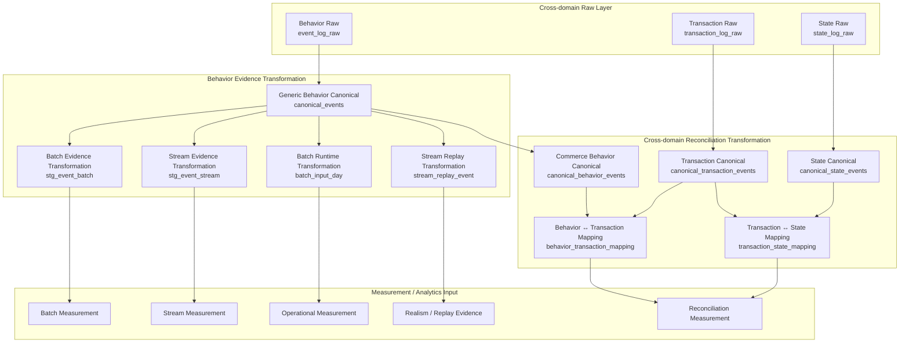

# Data Transformation Architecture

The current Transformation Layer is not a simple ETL normalization layer.

The architecture has two primary goals:

```text
1. Transform behavioral data into Batch / Stream / Runtime Evidence
2. Transform Behavior ↔ Transaction ↔ State flows into measurable consistency structures
```

In other words, the Transformation Layer does not merely normalize data.

Instead, it materializes:

```text
Operational Evidence Structure
+
Cross-domain Consistency Structure
```

for downstream Reliability Measurement and Analytics.

An important architectural principle is:

```text
Transformation
≠
Measurement
```

Transformation creates structures that can later be measured.

Actual reconciliation analysis, distortion analysis,
and risk interpretation are performed in the Measurement / Analytics Layer.

---

# Transformation Architecture Overview



---

# Overall Transformation Structure

The current Transformation Architecture consists of two major layers:

```text
Behavior Evidence Transformation
+
Cross-domain Reconciliation Transformation
```

The first layer transforms behavioral data itself into operational evidence structures.

The second layer transforms:

```text
Behavior
↔ Transaction
↔ State
```

into reconciliation-ready consistency structures.

Importantly, this layer still does not calculate risk scores.

```text
Transformation = structure generation
Measurement = consistency observation
Analytics = reliability interpretation
```

---

# Behavior Evidence Transformation

Behavior Evidence Transformation converts behavioral data into operational evidence structures.

The core flow is:

```text
event_log_raw
→ canonical_events
→ stg_event_batch
→ stg_event_stream
→ batch_input_day
→ stream_replay_event
```

`event_log_raw` is the raw behavioral event layer.

Representative events include:

```text
page_view
click
submit
conversion
campaign event
```

The purpose of this layer is to preserve raw operational behavior evidence.

At this stage:

```text
sessionization
distribution analysis
reconciliation
risk scoring
```

are not yet performed.

---

# Generic Behavior Canonical

`canonical_events` acts as the Generic Behavior Canonical Layer.

Its primary role is:

```text
Raw Behavior Event
→ Standardized Operational Event
```

Representative normalization includes:

```text
visitor normalization
session normalization
event normalization
pageview normalization
conversion normalization
campaign normalization
```

An important principle is:

```text
canonical_events
≠
risk authority
```

Instead:

```text
canonical_events
=
generic behavior evidence base
```

---

# Batch Evidence Transformation

Batch Evidence Transformation converts behavioral data into batch-operational evidence structures.

The actual implementation flow is:

```text
canonical_events
→ stg_event_batch
```

The goal of this layer is to support:

```text
traffic distribution analysis
campaign distribution analysis
conversion analysis
journey-stage aggregation
visitor/session aggregation
```

In other words:

```text
Behavior Canonical
→ Batch Operational Evidence
```

This layer later becomes input for batch analyzers such as:

```text
analyzer_b_v5_v04.py
```

which generate batch-level measurement evidence.

---

# Stream Evidence Transformation

Stream Evidence Transformation converts behavioral streams into stream-operational evidence structures.

The implementation flow is:

```text
canonical_events
→ stg_event_stream
```

Additionally, replay-compatible stream reconstruction is supported through:

```text
canonical_events
→ stream_replay_event
```

The goal of this layer is to support:

```text
stream completeness validation
duplicate detection
late-event validation
ordering validation
producer/consumer parity validation
```

In other words:

```text
Behavior Stream
→ Stream Operational Evidence
```

---

# Runtime Evidence Transformation

Runtime Evidence Transformation converts pipeline execution states into operational runtime evidence.

Representative implementation structures include:

```text
batch_input_day
stream_replay_event
```

The purpose of this layer is to materialize:

```text
batch execution readiness
pipeline availability
stream replay validation
runtime operational evidence
```

In other words:

```text
Pipeline Runtime
→ Operational Runtime Evidence
```

---

# Cross-domain Reconciliation Transformation

Cross-domain Reconciliation Transformation is the core of the current v0.5 architecture.

This layer connects:

```text
Behavior
↔ Transaction
↔ State
```

into reconciliation-ready structures.

The core flow is:

```text
canonical_behavior_events
canonical_transaction_events
canonical_state_events
→ behavior_transaction_mapping
→ transaction_state_mapping
```

Its purpose is not simple normalization.

Instead, it materializes:

```text
Cross-domain Operational Consistency Structure
```

---

# Commerce Behavior Canonical

`canonical_behavior_events` acts as a reconciliation-aware commerce behavior canonical layer.

The key distinction is:

```text
canonical_events
=
generic behavior canonical

canonical_behavior_events
=
commerce reconciliation behavior canonical
```

Representative identities include:

```text
journey_id
pcid
sid
uid
cart_id
order_id
payment_id
delivery_id
coupon_id
```

This layer transforms:

```text
Behavior Flow
→ Reconciliation-aware Behavior Evidence
```

---

# Transaction Canonical Transformation

`canonical_transaction_events` standardizes business transaction flows.

Representative events include:

```text
order_created
payment_requested
payment_success
coupon_applied
refund_requested
cancel_requested
```

This layer transforms:

```text
Transaction Flow
→ Business Transaction Canonical
```

---

# State Canonical Transformation

`canonical_state_events` standardizes workflow state transitions.

Representative states include:

```text
order_state
payment_state
delivery_state
refund_state
```

This layer transforms:

```text
Operational Workflow
→ State Canonical Evidence
```

---

# Behavior ↔ Transaction Mapping

This layer materializes consistency structures between behavior and transaction flows.

Representative implementation table:

```text
behavior_transaction_mapping
```

The key questions are:

```text
Did behavior lead to transactions?
Do transactions have behavioral provenance?
```

However, no reconciliation scores are calculated yet.

The purpose of this layer is structure generation for later measurement.

```text
Behavior Flow
+
Transaction Flow
→ Behavior-Transaction Consistency Structure
```

---

# Transaction ↔ State Mapping

This layer materializes consistency structures between transaction and state-transition flows.

Representative implementation table:

```text
transaction_state_mapping
```

The key questions are:

```text
Did transactions properly propagate into workflow states?
Do workflow states have valid transaction provenance?
```

Again, no semantic risk or reconciliation scores are calculated yet.

The purpose is:

```text
Transaction Flow
+
State Transition Flow
→ Transaction-State Consistency Structure
```

---

# Transformation Boundary

The Transformation Layer performs:

```text
Raw → Canonical normalization
Batch / Stream / Runtime evidence generation
Behavior / Transaction / State linkage generation
Consistency structure materialization
```

However, it does NOT perform:

```text
reconciliation_gap_score calculation
distortion_score calculation
semantic interpretation
overall_risk_score calculation
recommended_action generation
```

The Transformation Layer therefore ends at:

```text
stg_event_batch
stg_event_stream
batch_input_day
stream_replay_event
canonical_behavior_events
canonical_transaction_events
canonical_state_events
behavior_transaction_mapping
transaction_state_mapping
```

Everything beyond this point belongs to the Measurement / Analytics Layer.

---

# Architecture Principles

## Transformation ≠ Simple ETL Normalization

## Transformation = Operational Evidence Materialization

## Separate Behavior Evidence from Reconciliation Structure

## Separate Generic Behavior Canonical from Commerce Behavior Canonical

## Separate Transformation from Measurement

---

# Final Definition

The current Transformation Architecture is not a conventional ETL transformation layer.

More precisely, it is a:

```text
Behavior Evidence Transformation
+
Behavior ↔ Transaction ↔ State Reconciliation Transformation
```

architecture.

And more specifically:

```text
It materializes behavioral flows,
transaction flows,
and state-transition flows
into measurable operational evidence structures
and cross-domain consistency structures
for Operational Reliability analysis.
```
