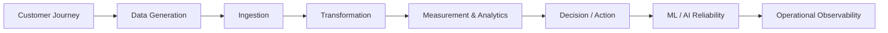

# Architecture

The current architecture is not a simple data pipeline or anomaly detection system.

The core objective is to use:

```text
Behavior
↔ Transaction
↔ State
```

based operational data to explain:

```text
When does data become unreliable?
Why are KPI and operational decisions distorted?
What operational risks emerge?
What actions should be taken?
```

The architecture is fundamentally a:

```text
Measurement
→ Reliability Analytics
→ Unified Risk
→ Operational Action
```

driven:

```text
Cross-domain Measurement-to-Decision Reliability Architecture
```

---

# Architecture Overview



---

# Customer Journey

All data begins from real operational flows.

The architecture uses:

```text
Journey as the source
Behavior / Transaction / State as parallel derivatives
```

This means the system does not follow a:

```text
Behavior → Transaction trigger
```

structure.

Instead, it follows:

```text
Customer Journey
→ Behavior
→ Transaction
→ State
```

as parallel operational outputs.

Representative domains:

```text
Commerce
Platform
Delivery
Operational Transaction
```

→ [View Customer Journey Architecture](/architecture/customer-journey)

---

# Data Generation

The Data Generation Layer creates realistic operational datasets.

Representative generated data:

```text
Behavior Log
Transaction Log
State Transition Log
```

Representative anomalies:

```text
partial missing
schema drift
identity drift
duplicate event
transaction-state mismatch
```

This layer reproduces:

```text
How operational data actually breaks
```

→ [View Data Generation Architecture](/architecture/data-generation)

---

# Ingestion

The Ingestion Layer loads generated data into the reliability pipeline.

Representative flow:

```text
Raw Snapshot
→ Staging
→ Collector
→ Event Raw
```

Behavior / Transaction / State logs are independently collected while remaining connected within the same operational flow.

The core objective is:

```text
Reproducible operational ingestion architecture
```

→ [View Ingestion Architecture](/architecture/ingestion)

---

# Transformation

The Transformation Layer converts operational logs into analyzable canonical structures.

Representative flow:

```text
Behavior Canonicalization
Transaction Canonicalization
State Canonicalization
```

followed by:

```text
Behavior ↔ Transaction Mapping
Transaction ↔ State Mapping
```

Core principle:

```text
canonical
=
business normalization

canonical
≠
risk scoring
```

This layer standardizes business meaning,
but does not determine operational risk.

→ [View Transformation Architecture](/architecture/transformation)

---

# Measurement & Analytics

The Measurement & Analytics Layer is the core of the architecture.

The most important principle is:

```text
Measurement
≠
Risk
```

Meaning:

```text
What was observed?
```

must remain separate from:

```text
Why is it risky?
```

Representative measurements:

```text
Behavior ↔ Transaction match
Transaction ↔ State consistency
Runtime evidence
Batch / Stream evidence
Customer impact
```

Representative analytics:

```text
Reconciliation Analytics
Propagation Analytics
Distortion Analytics
Amplification Analytics
Customer Impact Analytics
```

This layer interprets:

```text
Cross-domain Operational Reliability
```

→ [View Measurement & Analytics Architecture](/architecture/measurement-analytics)

---

# Decision / Action

The Decision / Action Layer transforms operational meaning into final operational risk and response.

Representative flow:

```text
Reliability Analytics
→ Unified Risk
→ Operational Action
```

Representative risks:

```text
Consistency Risk
Distortion Risk
Transaction Loss Risk
Runtime Reliability Risk
Customer Impact Risk
```

Representative actions:

```text
Reconciliation Audit
Pipeline Validation
Replay / Recovery
Operational Monitoring
```

Core principles:

```text
No False Escalation
No False Action
```

Baseline operational noise must not immediately escalate into operational incidents.

→ [View Decision / Action Architecture](/architecture/decision-action)

---

# ML / AI Reliability

ML/AI is not the authoritative decision engine.

Core philosophy:

```text
ML
=
Reliability Calibration

LLM
=
Evidence-bound Explanation
```

Meaning:

```text
ML does not determine final risk
LLM does not perform unrestricted reasoning
```

The ML/AI layer performs:

```text
Calibration
Explanation
Validation
Governance
```

Representative functions:

```text
Threshold Calibration
Distribution Calibration
Incident Explanation
Action Reasoning
AI Reliability Validation
Hallucination Prevention
```

This means:

```text
AI itself is also subject to reliability validation
```

→ [View ML / AI Reliability Architecture](/architecture/ml-ai-reliability)

---

# Operational Observability

The architecture is not limited to data analysis.

It also includes:

```text
Operational Reliability Observability
```

Representative observability areas:

```text
Batch Runtime
Stream Runtime
Serving Latency
Replay Consistency
Query Stability
Operational Evidence
```

The architecture observes not only:

```text
Does the data exist?
```

but also:

```text
Is the operational environment itself reliable?
```

→ [View Operational Observability Architecture](/architecture/operational-observability)

---

# Architecture Philosophy

The core philosophy of the overall architecture is:

```text
Measurement
→ Reliability Analytics
→ Unified Risk
→ Operational Action
```

combined with:

```text
Behavior
↔ Transaction
↔ State
```

based operational data interpretation.

The ultimate goal is to explain:

```text
When does operational data become unreliable?
```

The architecture is fundamentally a:

```text
Cross-domain
Measurement-driven
Operational Reliability Architecture
```
