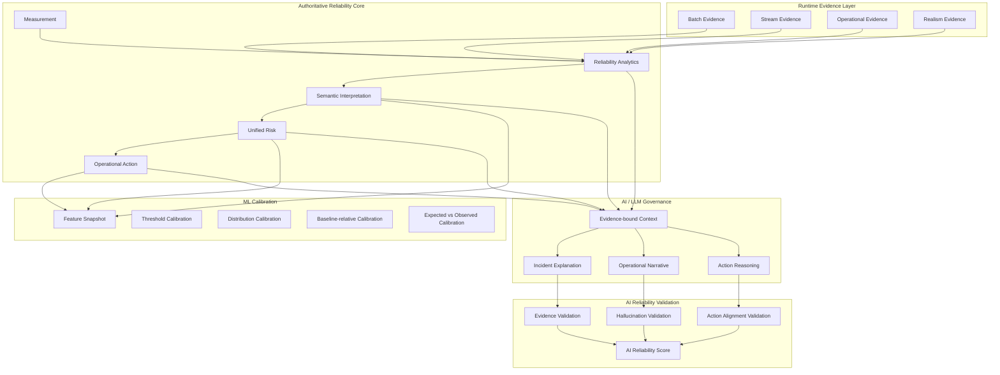

# ML / AI Reliability Governance Architecture

The current v0.5 ML/AI structure is not a conventional AI-based prediction system.

The core objective is to govern:

```text
Behavior
↔ Transaction
↔ State
```

based reliability decisions through:

```text
Calibration
Interpretation
Validation
Governance
```

In other words, the current ML/AI layer is not:

```text
Prediction-first AI
```

but rather:

```text
Operational Reliability Governance Layer
```

---

# Architecture Overview



---

# Operational Reliability Core

The authoritative core of the architecture remains:

```text
Measurement
→ Reliability Analytics
→ Semantic Interpretation
→ Unified Risk
→ Operational Action
```

The key principle is:

```text
ML/AI does not determine final operational risk
```

Representative authoritative domains:

```text
Behavior ↔ Transaction reconciliation
Transaction ↔ State consistency
Runtime operational evidence
Cross-domain reliability analytics
Operational action recommendation
```

---

# Runtime Evidence Integration

One of the most important additions in the final v0.5 implementation is the Runtime Evidence integration layer.

The architecture now directly connects:

```text
v0.4 Evidence Layer
→ v0.5 Commerce Reliability Analytics
```

through integrated runtime evidence structures.

Integrated evidence categories:

```text
Batch Evidence
Stream Evidence
Operational Evidence
Realism Evidence
```

Representative runtime signals:

```text
runtime_evidence_score
batch_evidence_score
stream_evidence_score
operational_evidence_score
realism_evidence_score
dominant_runtime_signal
```

The architecture now evaluates not only:

```text
Does the data exist?
```

but also:

```text
Is the operational environment itself reliable?
```

---

# ML Calibration Architecture

The current ML layer is not designed as a pure prediction engine.

Instead, it functions as a:

```text
Reliability Calibration Layer
```

Its purpose is to analyze:

```text
Is the risk/action distribution stable?
Are false escalations occurring?
Is semantic concentration emerging?
```

---

# Threshold Calibration

Primary purpose:

```text
False Escalation Suppression
```

Example:

```text
High runtime evidence alone
must not trigger high-risk escalation
```

This creates a:

```text
measurement-driven calibration structure
```

---

# Distribution Calibration

Primary purpose:

```text
semantic concentration stabilization
risk distribution stabilization
low/no-action convergence detection
```

Example:

```text
Coupon Attribution Distortion over-convergence detection
```

---

# Baseline-relative Calibration

Core philosophy:

```text
absolute anomaly
<
baseline-relative anomaly
```

Meaning:

```text
Deviation from baseline
is more important than the absolute value itself
```

---

# Expected vs Observed Calibration

One of the most important additions in the final implementation.

The architecture now compares:

```text
expected semantic/action
vs
observed semantic/action
```

Primary purpose:

```text
semantic specialization tuning
```

The calibration layer is therefore not a:

```text
hard failure detection system
```

but rather a:

```text
review-oriented stabilization framework
```

---

# Baseline False Escalation Guard

A critical operational stabilization mechanism.

When the system detects:

```text
baseline
+
stable runtime variation
```

the architecture applies:

```text
semantic escalation suppression
action suppression
```

Meaning:

```text
baseline-like variation
→ maintain no-action state
```

---

# AI / LLM Governance Architecture

The AI layer is not a:

```text
free-form reasoning AI
```

Instead, it functions as an:

```text
Evidence-bound Reliability Governance Layer
```

The AI layer is only allowed to interpret:

```text
measurement
analytics
semantic
risk
action
runtime evidence
```

Core principles:

```text
LLM does not directly interpret raw logs
LLM does not overwrite final risk/action decisions
```

---

# AI Functional Roles

The AI layer performs only the following functions:

```text
Incident Explanation
Operational Narrative
Evidence Summarization
Action Reasoning
```

Its primary purpose is to explain:

```text
Why is the system risky?
Why was a specific operational action recommended?
```

---

# AI Reliability Validation

One of the most important architectural principles is:

```text
LLM outputs are also subject to validation
```

Validation categories include:

```text
Missing Evidence Validation
Unsupported Explanation Validation
Hallucinated Reconciliation Validation
Wrong Operational Recommendation Validation
```

Meaning:

```text
AI explanations must remain inside authoritative evidence boundaries
```

---

# PASS_WITH_REVIEW Policy

A critical operational governance policy.

Core principle:

```text
AI validation FAIL
≠
pipeline FAIL
```

Meaning:

```text
AI explanation review required
```

must remain separate from:

```text
core reliability failure
```

Current policy:

```text
AI validation FAIL
+
AI reliability score = review
→ PASS_WITH_REVIEW
```

This preserves the authoritative reliability engine while requiring human review only for AI explanations.

---

# Replay Reliability Governance

The current ML/AI structure is no longer a simple online prediction architecture.

It already includes:

```text
7-day smoke
14-scenario smoke
30-day pilot
6-month replay
```

based replay stabilization governance.

The architecture has therefore evolved into:

```text
Operational Replay Reliability Governance
```

---

# Future ML / AI Expansion

Potential future expansion areas include:

```text
trained model prediction runner
derived ML feature layer
ML output verification
feature importance analysis
AI override guard
LLM execution governance
evidence coverage score
```

However, the core principles remain unchanged:

```text
ML prediction
≠
Authoritative Risk

LLM explanation
≠
Operational Truth
```

---

# Final Definition

The current v0.5 ML/AI structure is not simply an AI enhancement layer.

More precisely, it is an:

```text
Measurement
→ Reliability Analytics
→ Semantic Interpretation
→ Unified Risk
→ Operational Action
→ ML Calibration
→ AI Explanation
→ AI Validation
→ AI Reliability Governance
```

architecture that governs:

```text
Behavior
↔ Transaction
↔ State
```

based reliability decisions through:

```text
Calibration
Interpretation
Validation
Governance
```

This is fundamentally an:

```text
Operational ML / AI Reliability Governance Architecture
```
