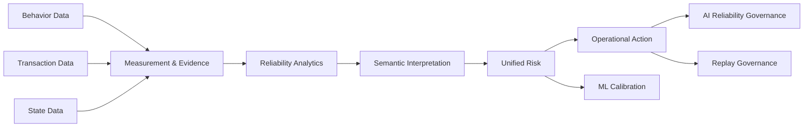

# Operational Reliability Control Tower Architecture

The current v0.5 Grafana structure has evolved beyond a traditional monitoring dashboard.

Instead of simple metric monitoring,
the architecture was redesigned as an:

```text
Operational Reliability Control Tower
```

The core objective is to explain:

```text
When does the system become unreliable?
Why does operational risk emerge?
Where did propagation occur?
What operational action is required?
```

using:

```text
Behavior
↔ Transaction
↔ State
```

based operational data.

The dashboard architecture operationalizes:

```text
Measurement
→ Reliability Analytics
→ Semantic Interpretation
→ Unified Risk
→ Operational Action
```

as an:

```text
Operational Reliability Governance Platform
```

---

# Architecture Overview



---

# Grafana Architecture Philosophy

The current v0.5 Grafana architecture is not focused on:

```text
signal monitoring
```

Instead, the architecture focuses on:

```text
operational reliability governance
```

The dashboard is designed to explain:

```text
Why is the system operationally risky?
Why was semantic escalation triggered?
Why was a specific operational action recommended?
```

rather than simply displaying anomalies.

---

# Dashboard Hierarchy

The current dashboard hierarchy is structured as:

```text
v05-control-tower/
├─ Executive Reliability Overview
├─ Runtime Evidence Control
├─ Reconciliation Reliability
├─ Semantic Risk Interpretation
├─ Unified Risk & Action
├─ ML Calibration Governance
├─ AI Reliability Governance
├─ Calibration Review
├─ Replay & Backfill Governance
└─ Operational Lineage
```

---

# Executive Reliability Overview

The top-level operational control dashboard.

Representative KPIs:

```text
overall_risk_score
final_risk_level
recommended_action
runtime_evidence_score
behavior_transaction_match_rate
transaction_state_match_rate
```

Representative visualizations:

```text
Reliability Trend
Risk Distribution
Semantic Distribution
Action Distribution
```

The primary objective is:

```text
Operational reliability status visibility
```

---

# Runtime Evidence Control

The Runtime Evidence layer visualizes:

```text
batch evidence
stream evidence
operational evidence
realism evidence
```

Representative runtime signals:

```text
batch_evidence_score
stream_evidence_score
operational_evidence_score
realism_evidence_score
runtime_evidence_score
```

Representative operational evidence:

```text
ordering gap
duplicate ratio
stream delay
batch completeness
```

Core principle:

```text
Runtime Evidence
≠
Authoritative Risk
```

Runtime evidence is treated as:

```text
supplementary operational evidence
```

---

# Reconciliation Reliability

The core dashboard of v0.5.

Purpose:

```text
Behavior ↔ Transaction ↔ State
```

consistency monitoring.

Representative measurements:

```text
behavior_transaction_match_rate
transaction_state_match_rate
behavior_only_count
transaction_only_count
orphan_state_count
transaction_without_state_count
```

Representative operational gaps:

```text
payment_order_gap
refund_transition_gap
coupon_reconciliation_gap
```

Core objective:

```text
Business operational consistency visualization
```

---

# Semantic Risk Interpretation

The architecture does not stop at anomaly detection.

Instead, it explains:

```text
Why is the system risky?
```

through semantic interpretation.

Representative semantic families:

```text
Completeness
Consistency
Integrity
Timeliness
Availability
Customer Experience Risk
Runtime Operational Reliability Risk
```

Representative visualizations:

```text
dominant semantic risk
semantic escalation trend
semantic distribution
```

---

# Baseline False Escalation Guard

One of the most important operational stabilization mechanisms.

Core principle:

```text
Evidence exists
≠
Operational escalation required
```

Baseline residual conditions maintain:

```text
None / low / no-action
```

states.

The dashboard explicitly visualizes:

```text
Evidence Exists BUT No Action
```

conditions.

---

# Unified Risk & Action

The current v0.5 architecture is not a:

```text
Detection System
```

It is an:

```text
Operational Decision Architecture
```

Representative risks:

```text
Consistency Risk
Distortion Risk
Transaction Loss Risk
Runtime Reliability Risk
Customer Impact Risk
```

Representative actions:

```text
reconciliation audit
pipeline validation
state replay validation
runtime review
queue backlog inspection
```

Core objective:

```text
Risk
→
Operational Action
```

---

# ML Calibration Governance

The ML layer is not:

```text
prediction-first ML
```

Instead, it functions as a:

```text
supplemental calibration layer
```

Representative calibration functions:

```text
threshold calibration
distribution calibration
baseline-relative calibration
semantic specialization tuning
```

Representative visualizations:

```text
prediction vs unified risk
false escalation rate
semantic concentration
expected vs observed distribution
```

Core principle:

```text
ML does NOT override unified risk
```

---

# AI Reliability Governance

The AI layer is not:

```text
free-form LLM monitoring
```

Instead, it operates as:

```text
Evidence-bound AI Governance
```

Representative validation categories:

```text
missing evidence validation
unsupported explanation validation
hallucinated reconciliation validation
wrong operational recommendation validation
```

Representative AI signals:

```text
AI reliability score
hallucination risk score
evidence coverage score
PASS_WITH_REVIEW
```

Core principle:

```text
LLM output
≠
Operational Truth
```

---

# Calibration Review Framework

The architecture includes:

```text
semantic/action calibration review
```

Representative comparisons:

```text
expected semantic
vs
observed semantic

expected action
vs
observed action
```

Core objective:

```text
semantic specialization stabilization
```

---

# Replay & Backfill Governance

The architecture includes:

```text
calendar-driven replay governance
```

Representative operational scopes:

```text
7-day smoke
14-scenario smoke
30-day pilot
6-month replay
```

Representative governance functions:

```text
scenario rotation
backfill coverage
lineage contamination detection
scenario identity propagation
```

---

# Operational Lineage

The architecture tracks:

```text
Operational Data Lineage
```

Representative lineage flow:

```text
Customer Journey
→ Source Log
→ Raw
→ Stage
→ Canonical
→ Measurement
→ Analytics
→ Semantic
→ Risk
→ Action
→ ML / AI
```

Core objective:

```text
Operational propagation tracking
```

---

# Runtime Evidence vs Authoritative Risk

One of the most important architectural principles.

---

## Runtime Evidence Layer

Representative roles:

```text
measurement
runtime evidence
analytics evidence
```

---

## Authoritative Layer

Representative roles:

```text
reconciliation
semantic interpretation
unified risk
operational action
```

---

## Core Principle

The dashboard explicitly separates:

```text
Evidence Layer
≠
Authoritative Decision Layer
```

---

# Operational Governance Philosophy

The architecture is not simple monitoring.

The core operational questions are:

```text
When does the system become unreliable?
Why is it risky?
Where did propagation occur?
What operational action is required?
```

The architecture is fundamentally:

```text
Measurement-driven
Evidence-aware
Reconciliation-centered
Semantic Governance
Operational Action Control
```

based.

---

# Final Definition

The current v0.5 Grafana architecture is not merely a dashboard implementation.

It is an:

```text
Measurement
→ Reconciliation
→ Reliability Analytics
→ Semantic Interpretation
→ Unified Risk
→ Operational Action
→ ML Calibration
→ AI Governance
→ Replay Governance
```

based:

```text
Operational Reliability Control Tower Architecture
```
